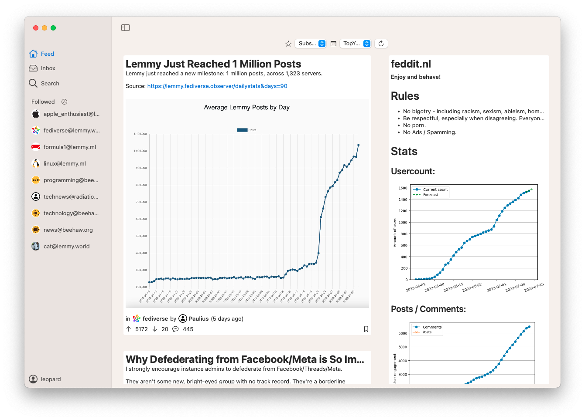
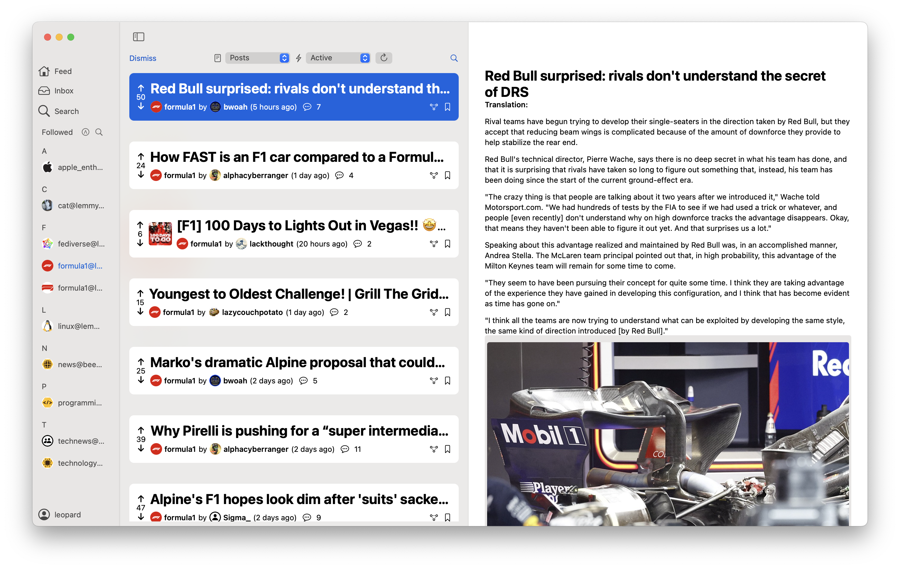
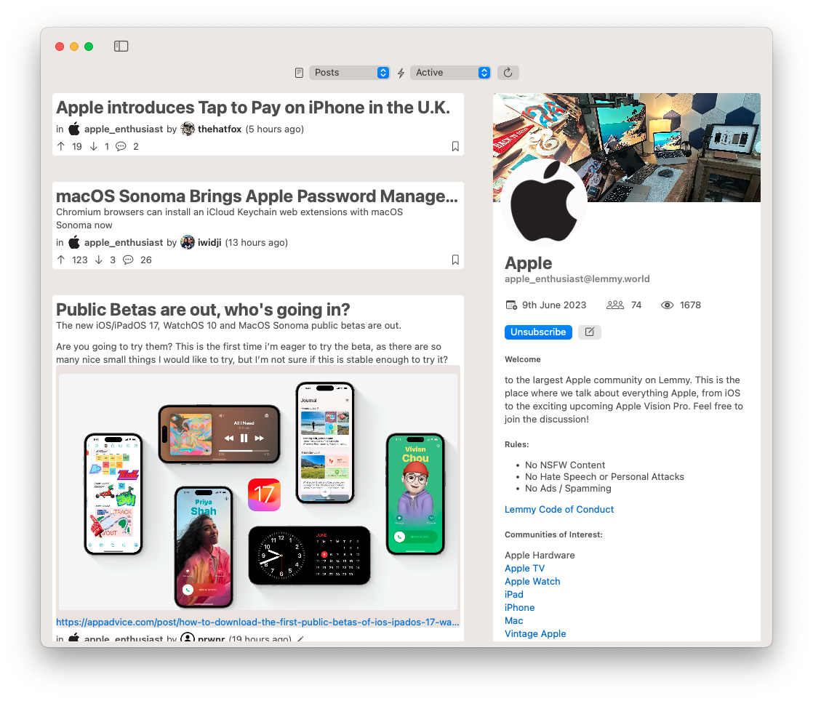
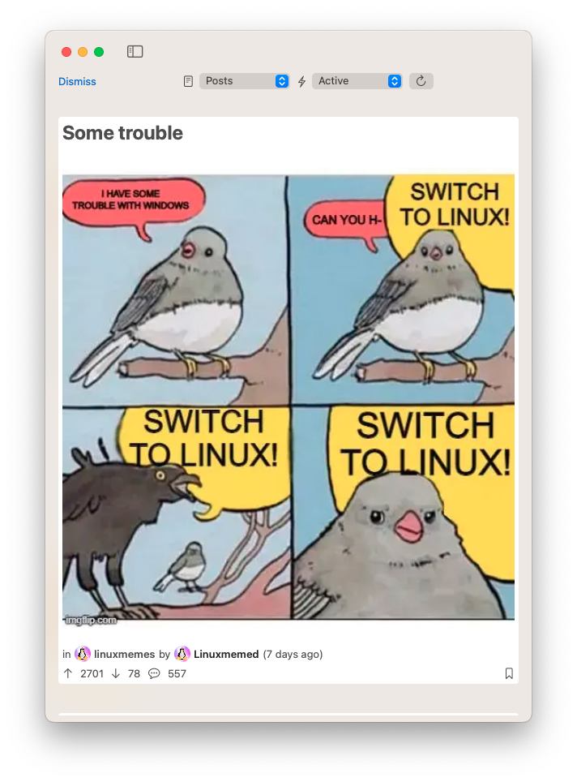
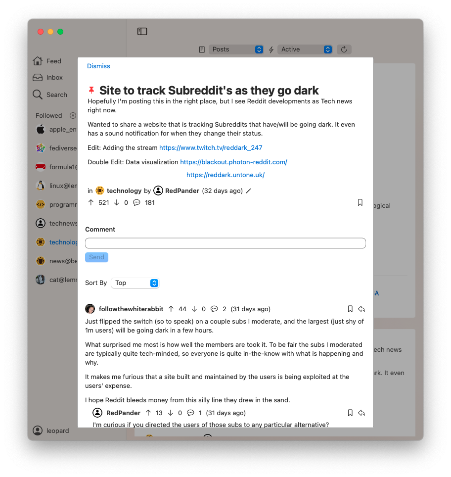
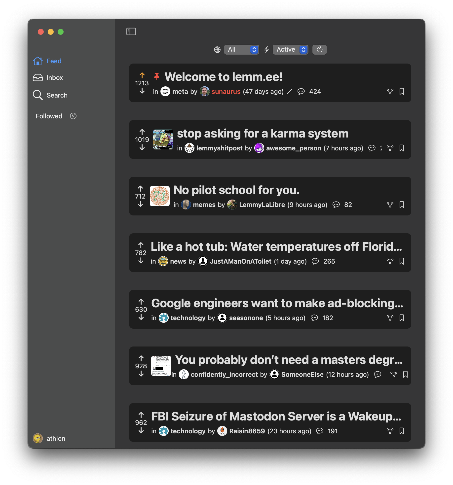

#  Leomard

Leomard is a Lemmy client for macOS, written in Swift using SwiftUI. Leomard allows you to browse Lemmy instances, view posts and comments, and create new posts and comments, read replies, and more.

Visit our [community on Lemmy](https://lemm.ee/c/leomard)!

I made this app, because I do not like Lemmy's web interface, and I wanted to learn Swift. Besides, I like using native apps more than web apps.

This app is free and open source, is not affiliated with Lemmy or its developers, and it is developed in my free time. Please note that this app is still in early development, so bugs and issues are to be expected.

### Why the name?

- Leopard, but with an M, because it's a Lemmy client (the app icon is a leopard)
- Leopards are larger than lemmings
- Cats are cool

## Requirements

- macOS 13.0 Ventura or later

## Installation

Download the .dmg file from the releases page, and drag the app to your Applications folder.

Start the app, you can login by clicking "Profile" in the bottom left corner.

*Note: You may be prompted to allow the app to access your Keychain. This is required to store your authorization token. It's recommended to press "Always Allow" to avoid having to enter your password every time you start the app.*

*Note: macOS may warn you that the app is from an unidentified developer. This is because I don't have an Apple Developer account, and the app has not been notarized. You can still run the app by going into System Settings > Privacy & Security > Scroll to Security section > Click "Open Anyway"*

## Screenshots

## Contributing

If you want to contribute to this project, you can do so by forking the repository, and then creating a pull request. You can also create an issue if you find a bug or have a feature request. Please see [CONTRIBUTING](CONTRIBUTING.md) for more information.

## Support

You can support me through here:

- [Ko-fi](https://ko-fi.com/athlon)
- [PayPal](https://www.paypal.com/donate/?hosted_button_id=8VASR9RLLS76Y)

## License

This project is licensed under GPL-3.0. See [LICENSE](LICENSE.md) for more information.

## Credits

- My friend **Fluffeline** for coming up with the whole Leopard thing
- App Icon by [vintprox](https://github.com/vintprox) licensed under CC-BY-SA
- [swift-markdown-ui](https://github.com/gonzalezreal/swift-markdown-ui) licensed under MIT License
- [Nuke](https://github.com/kean/Nuke) licensed under MIT License
- [HighlightedTextEditor](https://github.com/kyle-n/HighlightedTextEditor) licensed under MIT License